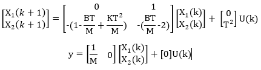
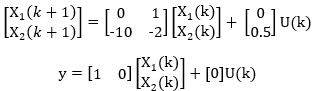

# Espacio de Estados en Sistemas Dinámicos
## Introducción
El espacio de estados es una representación matemática que describe el comportamiento de sistemas dinámicos al considerar no solo las entradas y salidas, sino también las variables internas del sistema. Esto permite una descripción completa de la dinámica y difiere de la función de transferencia, que se centra en entradas y salidas únicamente.

## Componentes del Espacio de Estados
- **Estado**: Conjunto de variables que permiten entender el comportamiento completo del sistema en un instante.
- **Variables de Estado**: Definen la dinámica del sistema. No siempre son medibles, pero su conocimiento es crucial para ciertos métodos de control.
- **Ecuaciones de Estado**: Combinan variables de estado mediante operadores matemáticos, formando un espacio geométrico llamado espacio de estados.

## Representación Matemática
Las ecuaciones de estado se representan usando las variables de entrada $u(k)$, salida $y(k)$ y variables de estado $x(k)$:

$X(k+1) = f(x(k), u(k), k)$

$y(k) = g(x(k), u(k), k)$

Las funciones $f$ y $g$ pueden ser no lineales y depender del tiempo, adaptándose a una gran variedad de sistemas.

## Representación Matricial
Para simplificar, se utiliza una representación matricial en modelos lineales:

$X(k+1) = A(k)X(k) + B(k)u(k)$

$y(k) = C(k)X(k) + D(k)u(k)$

En sistemas lineales invariantes en el tiempo las matrices $A$, $B$, $C$  y  $D$ son constantes, lo que facilita el análisis y diseño.

## Construcción del Espacio de Estados a partir de Ecuaciones Diferenciales
### Ejemplo y Representación Múltiple
Ecuacion diferencial: 

$u(t) - F_{K} - F_{B} = m * a$

En terminos de entrada y salida:

$u(t) - Ky(t) - By^{°}(t) = My^{°°}(t)$

Discretizando la ecuacion:

$MY(k+2) - 2MY(k+1) + MY(k) + BTY(k+1) - BTY(k) + T^{2}KY(k) = UT^{2}$

### Metodología para el Espacio de Estados
Para construir el modelo, se sigue un proceso de:
1. Despejar la máxima derivada en la ecuación de diferencias.
2. Igualar la salida a una variable de estado.
3. Aplicar adelantos para obtener las derivadas.
4. Organizar los términos en matrices $A$, $B$, $C$ y $D$.
   
### Aplicacion
1. $MY(k+2) = UT^{2} - (BT-2M)Y(k+1) - (M-BT-T^{2}K)Y(k)$
2. $MY(k) = x_{1}(k)$
3. $MY(k+1)=x_{1}(k+1)=x_{2}(k)$
   
   $x_{2}(k+1)=MY(k+2)$
   
4. $x_{1}(k+1) = x_{2}(k)$
   
   $x_{2}(k+1) = U(k)T^{2} - (\frac{BT}{M} - 2)x_{2}(k) - (1-\frac{BT}{M}+\frac{T^{2}K}{M})x_{1}(k)$

Representacion de estados por las matrices:

Figura 1. Imagen representacion de estados.

## Ejercicio 
1. $Y(k+2) = 0.5U(k) - 2Y(k+1) - 10Y(k)$
2. $Y(k) = x_{1}(k)$
3. $Y(k+1)=x_{1}(k+1)=x_{2}(k)$
   
   $x_{2}(k+1)=Y(k+2)$
   
4. $x_{1}(k+1) = x_{2}(k)$
   
   $x_{2}(k+1) = 0.5U(k) - 2x_{2}(k) - 10x_{1}(k)$

Representacion de estados por las matrices:

Figura 2. Imagen representacion de estados.

## Conclusiones
El espacio de estados es una herramienta fundamental para modelar sistemas dinámicos complejos y multivariables. Permite diseñar controladores robustos al adaptar el modelo a las necesidades específicas de cada aplicación, facilitando la implementación de sistemas de control efectivos y flexibles.

## Referencias
[1]“AulasVirtualesECCI: Entrar al sitio”, Edu.co. [En línea]. Disponible: https://aulas.ecci.edu.co/course/view.php?id=9304 . [Consulta: 10 de Octubre de 2024].

# Observadores de Estados y Control Integral en Sistemas Multivariables

Se presenta el diseño de observadores de estados y controladores con acción integral en sistemas de control multivariables avanzados. Se enfoca en la eliminación del error de estado estacionario y en la estimación de estados no medibles mediante observadores, proporcionando una metodología detallada para cada componente.

## Descripción General

En los sistemas de control multivariables, uno de los desafíos principales es mantener el error de seguimiento de referencia en cero. Esto se puede lograr mediante:
- Regulación: Cuando el objetivo es llevar el sistema a un estado donde la referencia es cero.
- Servo: Cuando el objetivo es seguir una referencia que no es cero, asegurando que la salida del sistema siga esta entrada.

Cómo se alcanzan estos objetivos mediante el diseño de un controlador que incluya un observador de estados, permitiendo estimar estados no medibles y asegurando el seguimiento preciso de la referencia.

## Control Integral

El control integral es esencial en sistemas multivariables para compensar el error de estado estacionario:

- Ley de Control Integral: Se utiliza una ley de control con un vector de ganancias $F$ para incluir la referencia en el sistema. Esto permite corregir el error de estado estacionario al hacer que los estados sigan la referencia deseada, manteniendo el error de estado en cero.

- Variables de Estado Ampliadas: Se amplían las variables del sistema mediante la introducción de una nueva variable de referencia. Las ecuaciones de estado se redefinen usando matrices extendidas que incluyen los términos $A$, $B$, $C$ y un control integral. Esto permite una compensación automática de errores en el sistema.

- Metodología de Diseño: 
  1. Definir matrices ampliadas $Aa$, $Ba$ y $Ca$.
  2. Calcular el vector de ganancia $Ka$ utilizando el método acker para ubicar los polos del sistema en la posición deseada en lazo cerrado.
  3. Definir el vector $K$ para los estados y $Ki$ para la regulación integral.
  4. Implementar el esquema de control integral, asegurando que el sistema siga la referencia deseada sin error estacionario.

## Observadores de Estados

Los observadores de estados permiten estimar las variables de estado que no son medibles directamente, una función crucial cuando no se cuenta con sensores para todos los estados del sistema.

- Propósito y Utilidad: Los observadores son herramientas fundamentales para la estimación de estados en sistemas multivariables, especialmente cuando no todas las variables de estado están disponibles para medición directa. Esto permite el control del sistema mediante la estimación continua de estos estados.

- Diseño del Observador:
  1. Observabilidad del Sistema: Verificar que el sistema sea observable, lo cual es un requisito esencial para el diseño de observadores. Esto se hace usando la matriz de observabilidad.
  2. Polinomio Característico: Determinar los coeficientes del polinomio característico en lazo abierto. En sistemas que están en forma canónica observable, esta tarea se simplifica.
  3. Selección de Polos del Observador: Definir el polinomio deseado mediante la ubicación de los polos del observador en la posición deseada, asegurando una respuesta rápida y precisa.
  4. Cálculo de la Matriz de Ganancias del Observador: La matriz de ganancias $K$ se obtiene mediante los métodos de diseño que posicionan los polos en los lugares óptimos.

## Manejo del Error de Estimación

El error en la estimación de estados puede variar según el diseño del observador y el uso de un vector de ganancias. Este proyecto aborda tanto el error sin ganancias como el error con ganancias, destacando lo siguiente:

- Error sin Vector de Ganancias: El error de estimación depende únicamente de la matriz $A$ del sistema, ya que no existe un control activo sobre el error de estimación. Este enfoque puede no ser suficiente en sistemas donde se requiere una mayor precisión en la estimación de estados.

- Error con Vector de Ganancias: Al introducir un vector de ganancias $K$ en el observador, el sistema ajusta los polos y controla activamente el error de estimación. Este enfoque mejora la precisión del observador y reduce el error en la estimación de los estados no medibles, logrando una mejor convergencia hacia los estados reales.

## Conclusión

Los observadores de estados y el control integral son herramientas cruciales para sistemas donde no es posible medir todos los estados directamente. Este proyecto demuestra cómo diseñar controladores con acción integral y observadores para sistemas multivariables avanzados, garantizando el seguimiento preciso de referencias y la reducción de errores de estimación. Los observadores de estados permiten la implementación de control efectivo en sistemas complejos, asegurando la estabilidad y el rendimiento deseado aun cuando no se pueden medir todos los estados.

## Referencias
[1]“AulasVirtualesECCI: Entrar al sitio”, Edu.co. [En línea]. Disponible: https://aulas.ecci.edu.co/course/view.php?id=9304 . [Consulta: 12 de Octubre de 2024].

